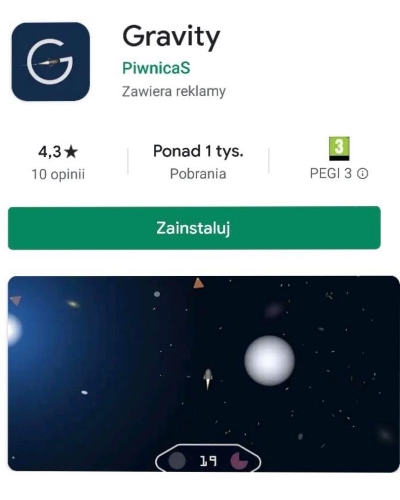

# Table of Contents
- [What I've learned](#what-Ive-learned)
- [Game concept](#game-concept)
- [Functions](#functions)   
   - [Object generator](#object-generator)   
   - [Steering](#steering)   
   - [Scaling the difficulty](#scaling-the-difficulty)   
   - [Objects](#objects)   
   - [Other](#other)
- [Second game version](#second-game-version)

# What I've learned
* How to make my own **mobile game** in Unity with implemented ads and Play Store release. (**C#, Unity**)
* Learn more about the [results](https://medium.com/@akuba_15181/how-much-money-my-mobile-game-made-2a70a6ea9dd5)

# Game concept
We have to fly the spaceship as far as possible with limited fuel and obstacles in the form of planets and asteroids. 
The planets have gravity, the ship will be steerable right, left, and special acceleration will be available from time to time. 
Fuel fills up near some random planets.

# Functions
## Object generator
Objects in the game are created randomly. The generator activates at certain times 3 functions that create planets, asteroids or suns. During generation, an area is selected randomly in which the function will try to find the appropriate position of the object up to 10 times. The areas are above the player, to the right, to the left, or to the bottom. The position is randomly selected in the area, and then it is checked whether the appropriate distances from other objects are kept. If the correct position cannot be found in 10 attempts, the object is not created. A potential improvement in the process is to replace these 10 attempts in some way. It may happen that in every attempt we miss the right position and the game "chokes".

## Steering
When we click the left half of the screen, we turn left, when the right half we turn right, clicking the right and left parts at once activates special boost. During deceleration in the collision avoidance system, steering force increases. If we don't orbit for a certain amount of time, fuel is used up faster. We cannot use acceleration in orbit, less than 2s after leaving orbit or when we do not have enough fuel. By using acceleration/boost we get a bonus to the result from 0 to 100 points.  
The game defines the player's maximum speed, and above this value, speed is reduced. The same applies to the minimum speed of the player. After exiting the orbit of the planet, if we orbit a certain time, we get additional acceleration. When we run out of fuel, speed is reducing till 0. Then an option appears to display the ad and continue the game. Also, the force applied to the ship is reducing with each frame.

## Scaling the difficulty
Playing up to 200 points (distance) is easy, and with 1600 points it is the hardest.
- When the player does not click the screen for a certain period of time (decreases with increasing distance), asteroids appear in front of the player.
- The speed of the game (timeScale) and the number of possible asteroids increases with distance.
- The angle in the collision avoidance system (deceleration) tends to zero as the distance increases.

## Objects
Planets have 1/3 probability that we can refuel by orbiting them. The most likely configuration is a planet with sparks, or a planet with a moon. Less common are sparks and moon and a planet without additional objects. The direction of the moon's rotation is chosen randomly.
  
The planets are random size within the given range, and the strength of gravity depends on their size. Objects are deleted automatically after exceeding a defined boundary (different for each object). Note the sun is the most expensive to render (additional lighting).

## Other
- When in the menu we enter and exit info 20 times in total, easterEgg appears
- The menu background is a game without a spaceship, we control it with the accelerometer.

# Second game version
Add a coin collection system, thanks to which we will be able to buy better ships for a given flight, with a larger fuel tank, with greater possibility of acceleration, with higher maximum speed.   

